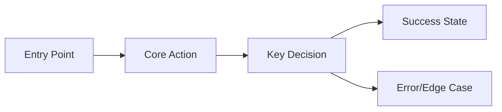

# /afc:ideate — Explore and Structure a Product Idea

> Transforms a rough idea, problem statement, or inspiration into a structured product brief (ideate.md).
> This is a **pre-spec exploration** tool — use it when you don't yet know exactly what to build.
> The output feeds directly into `/afc:spec` as input.

## Relationship to Other Commands

```
afc:ideate (what to build?) → afc:spec (how to specify it) → afc:plan → afc:implement → ...
```

- **ideate** = "I have an idea but haven't decided the scope, audience, or approach yet"
- **spec** = "I know what to build and need a formal specification"
- ideate is **never** part of the auto pipeline — it's a standalone exploration tool

## Arguments

- `$ARGUMENTS` — (required) One of:
  - Rough idea: `"real-time collaborative whiteboard"`
  - Problem statement: `"users keep losing unsaved work when the browser crashes"`
  - Reference URL: `"https://example.com/competitor-product"` (fetched and analyzed)
  - File path: `"./meeting-notes.md"` (read and extracted)

## Execution Steps

### 1. Parse Input

Determine the input type and extract raw content:

1. **If `$ARGUMENTS` starts with `http://` or `https://`**:
   - Fetch content via WebFetch
   - Extract: product name, key features, target audience, value proposition
   - Frame as: "Build something similar/better that addresses {gap}"

2. **If `$ARGUMENTS` is a file path** (contains `/` or ends with `.md`/`.txt`):
   - Read the file content
   - Extract: action items, feature requests, pain points, user feedback
   - Frame as: structured requirements from raw notes

3. **Otherwise**: treat as a natural language idea/problem statement

### 2. Market & Context Research

Perform lightweight research to ground the idea in reality:

1. **Competitive landscape** (WebSearch):
   - Search: `"{core concept}" tool OR app OR service {current year}`
   - Identify 3-5 existing solutions
   - Note: what they do well, what gaps exist

2. **Technology feasibility** (WebSearch, optional):
   - If the idea involves unfamiliar tech: search for current state and constraints
   - Tag findings with `[RESEARCHED]`

3. **Target user validation**:
   - Who would use this? Why? What's their current workaround?

### 3. Explore Existing Codebase (if applicable)

If running inside a project with source code:

1. Check if any related functionality already exists (Glob/Grep)
2. If found: note as "Existing foundation" — ideate around extending, not rebuilding
3. If no codebase or greenfield: skip this step

### 4. Write Product Brief

Create `.claude/afc/ideate.md` (overwrite if exists after confirmation):

```markdown
# Product Brief: {idea name}

> Created: {YYYY-MM-DD}
> Status: Exploration
> Input: {original $ARGUMENTS summary}

## Problem Statement
{What problem does this solve? Who has this problem? How painful is it?}
{2-3 sentences, specific and measurable where possible}

## Target Users

### Primary Persona
- **Who**: {role/demographic}
- **Context**: {when/where they encounter the problem}
- **Current workaround**: {what they do today}
- **Pain level**: {High/Medium/Low — with justification}

### Secondary Persona (if applicable)
{same format}

## Value Proposition
{One sentence: "For {persona} who {need}, this {product} provides {benefit} unlike {alternatives}"}

## Core Features (MoSCoW)

### Must Have (MVP)
1. {feature} — {why it's essential}
2. {feature} — {why it's essential}
3. {feature} — {why it's essential}

### Should Have (v1.1)
1. {feature} — {value added}

### Could Have (future)
1. {feature} — {potential value}

### Won't Have (explicit scope cut)
1. {feature} — {why excluded}

## User Journey (primary flow)



{Describe the 3-5 step primary user flow in plain text as well}

## Competitive Analysis

| Aspect | {Competitor 1} | {Competitor 2} | This Product |
|--------|---------------|---------------|-------------|
| Core strength | {X} | {X} | {X} |
| Key weakness | {X} | {X} | {X} |
| Pricing | {X} | {X} | {X} |
| Differentiator | — | — | {what makes this unique} |

## Open Questions
- {Decision that needs user input before proceeding to spec}
- {Technical uncertainty that affects scope}
- {Business assumption that should be validated}

## Suggested Next Steps
1. Resolve Open Questions above
2. Run `/afc:spec {refined feature description}` to formalize as a specification
3. {Any other recommended action}

## Research Sources
- [{source title}]({url}) — {what was learned}
```

### 5. Interactive Refinement

After writing the initial brief, present key decisions to the user:

1. **Scope check**: "The MVP has {N} features. Does this feel right, or should we cut/add?"
2. **Persona validation**: "Is {persona} the right primary user?"
3. **Open questions**: present the top 2 unresolved questions via AskUserQuestion

Apply user feedback directly into ideate.md.

### 6. Final Output

```
Ideation complete
├─ .claude/afc/ideate.md
├─ Personas: {count}
├─ MVP features: {count}
├─ Competitors analyzed: {count}
├─ Open questions: {count}
├─ Research sources: {count}
└─ Next step: /afc:spec "{suggested feature description}"
```

## Notes

- **This is exploration, not specification**. Do not write acceptance criteria, system requirements, or FR/NFR numbers — that belongs in `/afc:spec`.
- **ideate.md lives at `.claude/afc/ideate.md`** (project-level, not feature-level) because ideation may span multiple features.
- **Not part of the auto pipeline**. ideate is manually invoked when a developer needs to think through an idea before committing to a spec.
- **One ideate.md per project** — overwrite on re-run (with confirmation). If you need to preserve a previous ideation, rename it first.
- **Competitive analysis is lightweight** — 3-5 competitors max. Deep market research is not the goal; grounding the idea in reality is.
- **Mermaid diagrams are optional** — only include if the user flow benefits from visualization. Do not force diagrams for simple concepts.
