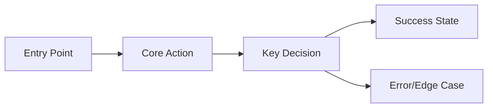

# Product Brief: {idea name}

> Created: {YYYY-MM-DD}
> Status: Exploration
> Input: {original $ARGUMENTS summary}

## Problem Statement
{What problem does this solve? Who has this problem? How painful is it?}
{2-3 sentences, specific and measurable where possible}

## Target Users

### Primary Persona
- **Who**: {role/demographic}
- **Context**: {when/where they encounter the problem}
- **Current workaround**: {what they do today}
- **Pain level**: {High/Medium/Low — with justification}

### Secondary Persona (if applicable)
{same format}

## Value Proposition
{One sentence: "For {persona} who {need}, this {product} provides {benefit} unlike {alternatives}"}

## Core Features (MoSCoW)

### Must Have (MVP)
1. {feature} — {why it's essential}
2. {feature} — {why it's essential}
3. {feature} — {why it's essential}

### Should Have (v1.1)
1. {feature} — {value added}

### Could Have (future)
1. {feature} — {potential value}

### Won't Have (explicit scope cut)
1. {feature} — {why excluded}

## User Journey (primary flow)

{Describe the 3-5 step primary user flow in plain text as well}

## Competitive Analysis

| Aspect | {Competitor 1} | {Competitor 2} | This Product |
|--------|---------------|---------------|-------------|
| Core strength | {X} | {X} | {X} |
| Key weakness | {X} | {X} | {X} |
| Pricing | {X} | {X} | {X} |
| Differentiator | — | — | {what makes this unique} |

## Open Questions
- {Decision that needs user input before proceeding to spec}
- {Technical uncertainty that affects scope}
- {Business assumption that should be validated}

## Suggested Next Steps
1. Resolve Open Questions above
2. Run `/afc:spec {refined feature description}` to formalize as a specification
3. {Any other recommended action}

## Research Sources
- [{source title}]({url}) — {what was learned}
